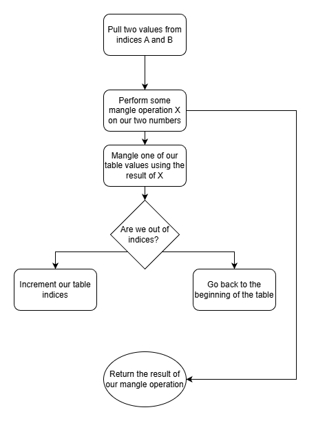

# Understanding (and exploiting) the rand() function in libc

This weekend, I played BackdoorCTF with my team L3ak. There was one challenge I found really interesting; you get some leaks, you're allowed to zero out a few values at an arbitrary place in memory, and you need libc's `rand()` function to return an abnoramlly small value to trigger a `win()` function. So, after I spent a few hours looking into exactly how libc generates random numbers, I finally solved the challenge. So, i was thinking... My github has been looking a little barren lately and the granular, inner workings of libc are always super interesting, and this is a neat little topic that it looks like nobody else has really covered in this much detail... So here we are!

## Part I: `rand()`, `unsafe_data`, and `randtbl`

The `rand()` function can work off of several different configurations that determine what it's mangling operation is, what the inputs to the mangling operation are, etc, but the one used in the challenge I solved was `TYPE_3`, so that's the one we'll be looking at today. 

The basic implementation of the `rand()` function works, basically, like this:

### The logic
- We have some mangle operation `X(a, b)` 
- We maintain a table of numbers to use as inputs to X
- Every time we use an index, we mangle that value in the table

Or, in flowchart form: 



### The code
In `stdlib.h`, we have the struct used to keep track of all the stuff outlined above. The `rand_type` field also determines the configuration stuff I alluded to at the beginning of this section. An instance of it, called `unsafe_state`, is stored in libc's bss, and is referenced whenever `rand()` is called. 
```c
struct random_data
  {
    int32_t *fptr;		/* Front pointer.  */
    int32_t *rptr;		/* Rear pointer.  */
    int32_t *state;		/* Array of state values.  */
    int rand_type;		/* Type of random number generator.  */
    int rand_deg;		/* Degree of random number generator.  */
    int rand_sep;		/* Distance between front and rear.  */
    int32_t *end_ptr;		/* Pointer behind state table.  */
  };
```
The important fields for the flowchart/steps I mentioned, however, are these ones:
```c
struct random_data
  {
    int32_t *fptr;	
    int32_t *rptr;	
    int32_t *state;	
    int32_t *end_ptr;	
  };
```
Whenever `rand()` is called, we end up in `__random_r()`, which is defined in `random_r.c`.
The function starts by checking the `rand_type` field, and using an even simpler number generator for type 0, but the code for type 3, which we're looking at, looks like this.

I'll break this down into two parts - the code doing the generating, and the code managing table indices. First, let's look at our actual random number generator. 
```c
      int32_t *fptr = buf->fptr;
      int32_t *rptr = buf->rptr;
      int32_t *end_ptr = buf->end_ptr;
      uint32_t val;

	  // Our basic mangling operation is just (A+B) >> 1	
      val = read_state (fptr, 0);
      val += read_state (rptr, 0);
	      
	  //Mangle one of our table values and bitshift the value to return
      write_state (fptr, 0, val);
      *result = val >> 1;
	

```
So, it turns out, the number generator isn't actually that complicated. For my purposes, I only needed to clobber the table until I got a 0 back, but to force the return of any number n, all you would have to do is calculate the right table indices to overwrite (which I'll cover in a minute), and then set up the values as `0` and `2n`, `n` and `n`, or whatever else satisfies `(a+b) >> 1 = n` . 

Now, let's look at the index math:
```c
    ++fptr;
    if (fptr >= end_ptr)
	{
	  fptr = state;
	  ++rptr;
	}
      else
	{
	  ++rptr;
	  if (rptr >= end_ptr)
	    rptr = state;
	}
      buf->fptr = fptr;
      buf->rptr = rptr;
    }
```
We basically advance each pointer 4 bytes at a time every time we call `__random_r`. Interestingly, the bounds check is never applied to both fptr and rptr due to the `else` condition, which would never cause a problem in normal execution but could make for some interesting strategies which I'll discuss in the next section. 
 
The `state` and `end_ptr` values act as the bounds of the table, and in order to use corruption of the `random_data` struct for leaks, writes, or anything other than returning decidedly nonrandom numbers, one or both would need to be corrupted. 

## Part II: Exploitation 


<b> Returning non-random numbers</b>
The simplest abuse of rand() can be done without touching the pointers in `random_data`, just by corrupting `randtbl`.  If you have a larger write, you can simply zero out the entirety of `randtbl` and go about your merry way. In situations like the BackdoorCTF challenge I mentioned at the beginning, however, it gets a bit more complicated. 

Let's take a look at abusing `randtbl()` in a constrained environment. For this challenge, I already had a leak of libc, and I could zero out 8 bytes at a time of arbitrary memory. `rand()` was also called before every write, meaning the table indices updated every time I zeroed something out. Once I had set up functions for my write primitive, my code looked something like this:
```py
clobber(randtbl+8) # WRITE 1
clobber(randtbl+24) # WRITE 2
proc.interactive() # Select the last menu option by hand, for that sweet feeling of victory
``` 
I also threw together a quick little diagram to have something more visual, and you can see how the moving indices eventually both land on 0, forcing rand to return `NULL`.  


#### Other use cases/possibilities: 
The lack of restriction/checks on `state` and `end_ptr` pointers: While it's by no means a high-value target like heap metadata or file structs, the code responsible for resetting fptr and rptr at the end of the table could allow for a pretty cool -if limited- way to leak, modify, or otherwise mess with pointers both in and outside of libc's bss. 
<br>
<br>
<br>
#### <b> Leakless shenanigans </b>
One more possibility I noticed lies in the modification of whatever `fptr` points towards. Particularly, since it's an addition operation, it could be used to do things like altering a saved return pointer using only an offset, without requiring a leak. It's not a particularly useful technique, it's rare that you would have the primitives & leaks to do this but not something easier or simpler, but I thought it was cool.   

Consider a program with a `main()` function and a `win()` function. Assuming that you can write within libc and have a stack leak, control flow can be redirected like this:

```c
int main(){
	unsafe_state->fptr = saved_rip_addr;
	*rptr = offset_from_main_to_win
	rand();
	return;
}
```

<br><br><br>
<b>ok thats pretty much it alright bye</b>
